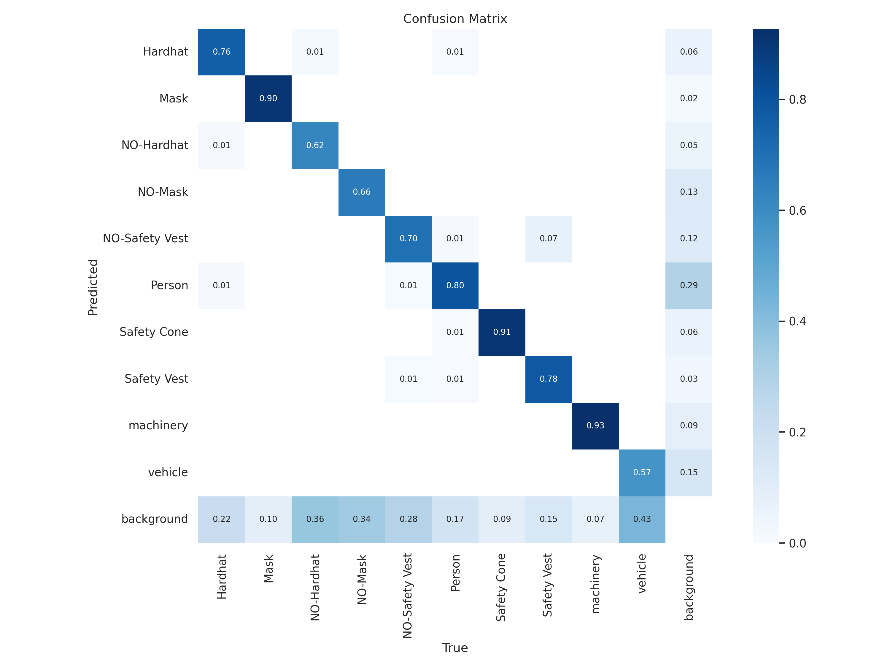
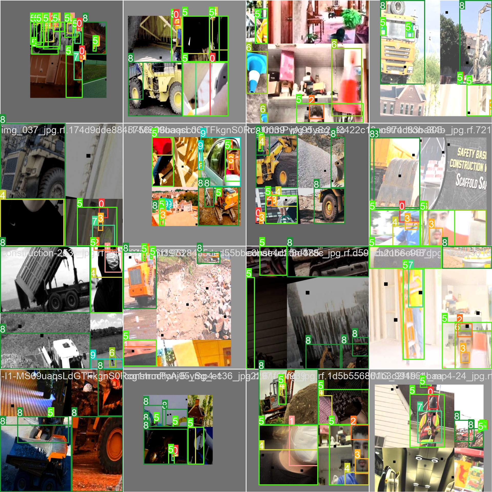

# Construction Site Safety PPE Detection System


## 🏢 Overview
This project is an Integrated Safety Monitoring System designed for construction sites. It leverages **YOLOv8** for real-time Personal Protective Equipment (PPE) detection, providing a full-stack solution with a dashboard for safety officers.

> **Safety Fact:** Workers in construction occupations account for nearly 20% of all fatal workplace injuries. This system aims to reduce these risks through automated monitoring and alerting.

---

## 🚀 System Architecture
The project is organized as a **Monorepo** with three core components:

| Component | Technology | Role |
| :--- | :--- | :--- |
| **Frontend** | Angular + TailwindCSS | Real-time dashboard and camera management. |
| **Backend** | .NET (ASP.NET Core) | Orchestrator API & Business logic. |
| **AI Service** | FastAPI + YOLOv8 | Computer Vision engine for PPE detection. |

---

## 📂 Project Structure
```text
├── frontend/             # Angular Dashboard
├── backend/              # .NET Core Orchestrator
├── ai-service/           # Python AI Engine (FastAPI)
├── data/videos/          # Test camera sources (MP4)
├── infrastructure/       # Deployment and setup scripts
└── workspace/            # Historical ML artifacts & results
```

---

## ⚙️ Setup & Installation

### 1. AI Service (Python)
```bash
cd ai-service
python -m venv venv
source venv/bin/activate  # or venv\Scripts\activate on Windows
pip install -r ../requirements.txt
python main.py
```

### 2. Backend (.NET)
```bash
cd backend
dotnet restore
dotnet run --project ReportAi.Orchestrator.Api
```

### 3. Frontend (Angular)
```bash
cd frontend
npm install
npm start
```

---

## 📊 Detection Capabilities
The system detects the following classes:
- ✅ **PPE:** Hardhat, Mask, Safety Vest, Safety Cone.
- ❌ **Violations:** NO-Hardhat, NO-Mask, NO-Safety Vest.
- 👤 **Other:** Person, Machinery, Vehicle.

---

## 🛠️ Key Features
- [x] **Real-time PPE Detection** using YOLOv8.
- [x] **Camera Management:** Enable/Disable cameras (Passive/Active state).
- [x] **MJPEG Streaming:** AI-processed video stream directly in the browser.
- [x] **Alert System:** Real-time logging of safety violations.
- [x] **Monorepo Design:** Easy orchestration of all services.

---

## 📈 Results & Visuals
The YOLOv8n model was trained for 100 epochs, achieving high precision in detecting safety gear in diverse conditions.




---

## 🤝 Contributing
1. Clone the repo.
2. Initialize and push to your remote.
3. Add collaborators via GitHub Settings.

---

## 📝 License
MIT License

## Future Work

1. Train the model for more epochs.
2. Compare with 4 other models by YoloV8.
3. Create ID tracking of workers and save bounding boxes of workers not wearing proper PPE.
4. ML App deployment with alarm trigerring.
